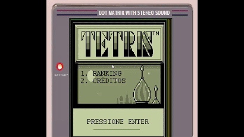

<h1 align="center">Tetris</h1>

## Project

This project is a Tetris game using C programming language and Allegro library.

  

## Tecnologies

This project was built using the following technologies:

- [C](https://www.iso.org/standard/74528.html)
- [Allegro v4.1.17-1](https://liballeg.org/)
